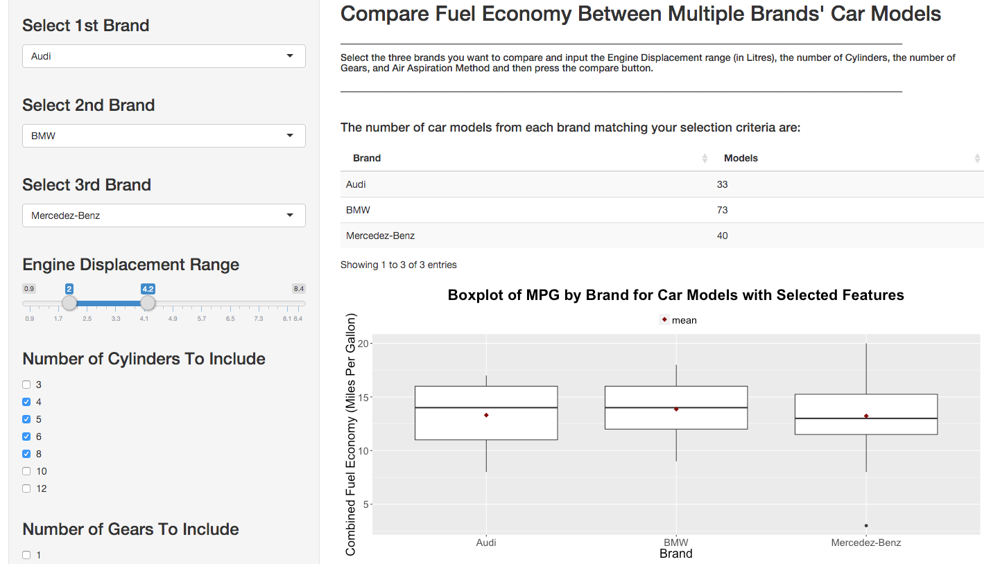

--- 
title       : Car Master 2016
subtitle    : 
author      : Andrew Kostandy
job         : Developing Data Products Student
framework   : io2012        # {io2012, html5slides, shower, dzslides, ...}
highlighter : highlight.js  # {highlight.js, prettify, highlight}
hitheme     : tomorrow      # 
widgets     : [bootstrap]            # {mathjax, quiz, bootstrap}
mode        : selfcontained # {standalone, draft}
knit        : slidify::knit2slides
--- .class #id bg:lightblue

## App Description

Car Master 2016 is the app to have if you're planning to buy a car and fuel economy is a priority to you! Fuel prices may be low at the moment, but 2 years from now you may wish you never bought that 6.8L, 8 cylinder, turbocharged gas-guzzler of a car!

There are 3 use cases of this app:

1. To Predict the Fuel Economy of a Car Model based on Car Features like Enginge Displacement,
Number of Cylinders, Number of Gears, and Engine Air Aspiration Method.
2. To Compare the Fuel Economy of Different Brands for their Car Models with your Selected Features.
3. If you already have a car in mind, to Compare it's Fuel Economy to the Fuel Economy of other Models that have the similar Features.

--- .class #id bg:lightblue   

## Elegant & Easy To Use User Interface

<div style='text-align: center;'>
    
</div>

--- .class #id bg:lightblue

## Basic Logic - Predicting Fuel Economy

We use a Random Forests Algorithm to predict Fuel Economy. I have used the default values of selected Features in the App for this example.

```{r echo=FALSE}
library(caret)
thedata<-read.xlsx2("2016_FE_Guide.xlsx",sheetName="FEguide")
usedData<-data.frame(Division=thedata$Division,EngDispl=thedata$Eng.Displ,
                     Cyl=thedata$X..Cyl,
                     CombFE=as.integer(thedata$Comb.FE..Guide....Conventional.Fuel),
                     Gears=thedata$X..Gears,FuelType=thedata$Fuel.Usage....Conventional.Fuel,
                     AirAspir=thedata$Air.Aspir.Method)
usedData$EngDispl<-as.character(usedData$EngDispl)
usedData$EngDispl<-as.numeric(usedData$EngDispl)
usedData<-usedData[is.na(usedData$EngDispl)==FALSE,] ## We exclude Cars with no Engine Displacement Information
usedData<-filter(usedData,FuelType!="DU") ## We exclude Diesel Cars
usedData<-filter(usedData,AirAspir!="TS") ## We exclude Cars with Air Aspiration Method as Turbocharged + Supercharged
```

```{r cache=TRUE}
set.seed(12345)
rfmodFit<-train(CombFE~EngDispl+factor(Cyl)+factor(Gears)+factor(AirAspir),
                data=usedData,method="rf",PROX=TRUE)
test<-data.frame(EngDispl=3.0,Cyl=6,Gears=6,AirAspir="NA")
round(predict(rfmodFit,test),2)
```

--- .class #id bg:lightblue

## Start Using Car Master 2016 Today! 

The App can be used for free! It's accessible through this link: [Car Master 2016] (https://andrewkostandy.shinyapps.io/MasterProjectwithRF/) (https://andrewkostandy.shinyapps.io/MasterProjectwithRF/)

### Data Source:

This app uses Fuel economy data that are the result of vehicle testing done at the 
Environmental Protection Agency's National Vehicle and Fuel Emissions Laboratory in Ann Arbor,
Michigan, and by vehicle manufacturers with oversight by EPA.

This data is available from the fueleconomy.gov website. Fueleconomy.gov is the official
U.S. government source for fuel economy information.
                       
We use the 2016 datafile which can be accessed directly through the
link: https://www.fueleconomy.gov/feg/epadata/16data.zip
or from the webpage: https://www.fueleconomy.gov/feg/download.shtml
                       
Note that we disregard car models running on Diesel. We also disregard car models without Engine Displacement
information as well as car models with Engine Air Aspiration Method of "Turbocharged + Supercharged".


